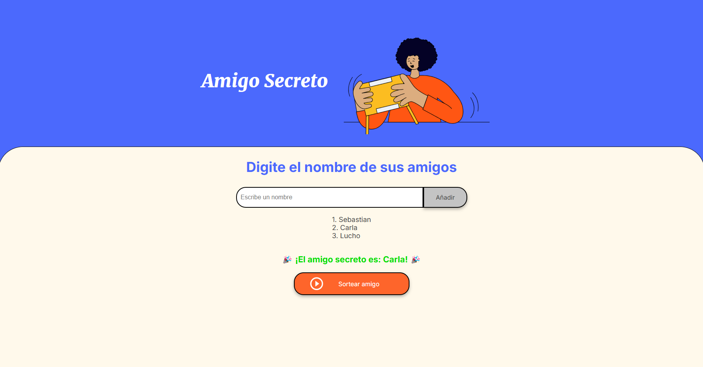

# Juego_Amigo_secreto

Este es un proyecto que implementa un juego interactivo para seleccionar de forma aleatoria un "Amigo Secreto" de una lista de nombres proporcionada por el usuario. El proyecto está desarrollado utilizando **HTML**, **CSS** y **JavaScript**.

## Descripción
El objetivo principal de este proyecto es permitir a los usuarios añadir nombres de amigos a una lista y luego sortear aleatoriamente uno de esos nombres para seleccionar el "Amigo Secreto". El juego asegura que cada participante tenga las mismas probabilidades de ser elegido.

### Funcionalidades
- **Añadir amigos:** Permite ingresar nombres y almacenarlos en una lista dinámica.
- **Visualización de la lista:** Muestra todos los nombres ingresados en tiempo real.
- **Sorteo aleatorio:** Selecciona aleatoriamente a un "Amigo Secreto" de la lista.
- **Mensajes interactivos:** Proporciona alertas para entradas inválidas o cuando no hay nombres en la lista.

## Cómo utilizar
1. Clona este repositorio:
    ```bash
    git clone https://github.com/Benjhi-5/Juego_Amigo_secreto.git
    ```
2. Abre el archivo `index.html` en tu navegador.
3. Ingresa los nombres de los participantes en el campo de entrada y presiona "Añadir".
4. Una vez que todos los nombres estén en la lista, haz clic en "Sortear amigo" para obtener al "Amigo Secreto".

## Captura de pantalla

